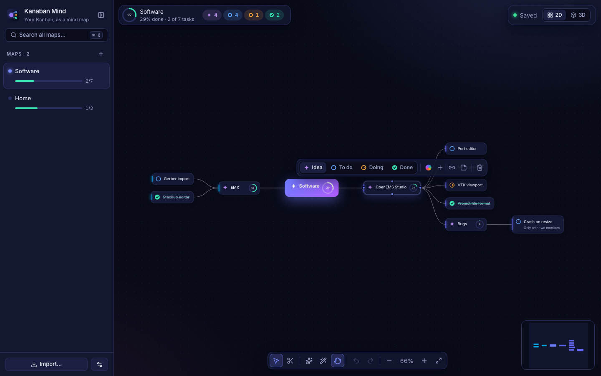
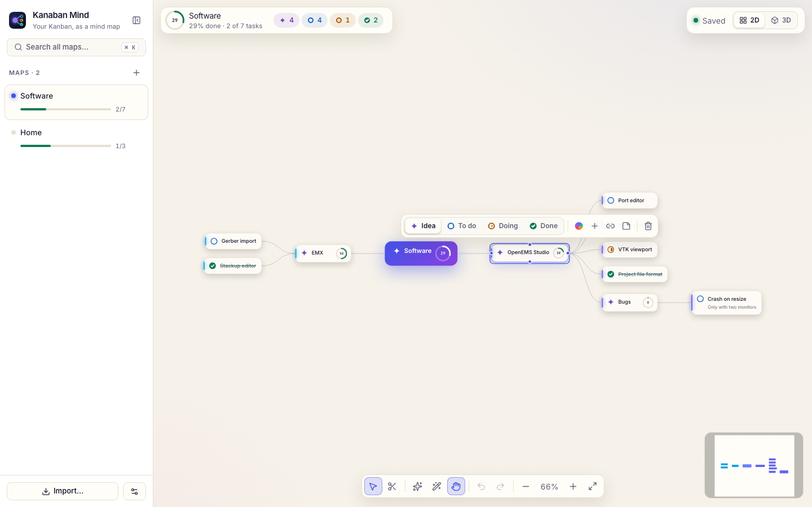
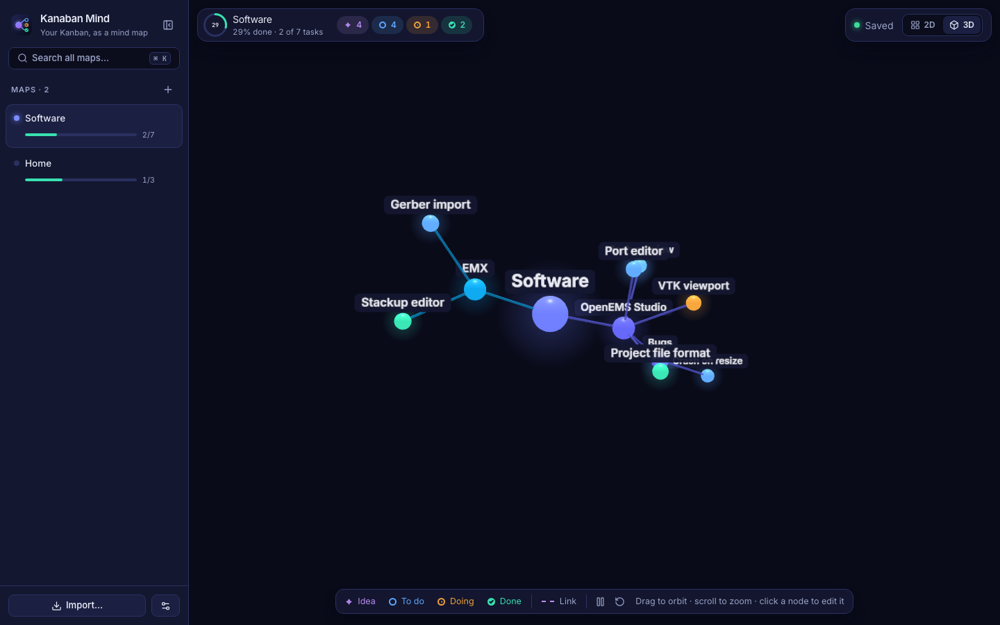

# Kanaban Mind

**Your Kanban board, as a mind map.** Every task is a node on an infinite canvas.
Branch out with <kbd>Tab</kbd>, connect any node to as many others as you like,
cut a connection with a swipe, and watch every branch fill its progress ring as
tasks get done. Several maps side by side, search across all of them, and a 3D
view to see a whole map at once.

| Midnight | Daylight |
|---|---|
|  |  |



*(Screenshots use a made-up sample board.)*

The Kanaban board app is left exactly as it is — Kanaban Mind is a separate
program. On its first start it imports the Kanban's `board.json` once: each
category becomes a map, each board a branch, each card a node with its status.

## On the other PCs: through the Kanban board

The Kanban board ([Kanaban_](https://github.com/AmjadTrablsiD1/Kanaban_)) carries this
app in its `mind/` folder since version 2.0. On a PC with the classic board, press
**Update now** (or `git pull`): the start page becomes Kanaban Mind, the board's own
`board.json` is turned into maps on the first start (and only read, never changed), and the
classic board stays at `/classic`. Nothing to install — Python's standard library is enough.

To publish a new version from this repo:

```bash
scripts/ship_to_kanban.sh ~/Desktop/Projects_Git/Kanaban/Kanaban
```

then bump `version.json` there, commit and push. Only files git tracks here are copied,
plus the built UI — never a map or a board.

## Install (this Mac, on its own)

```bash
./install.sh
```

Builds the UI, installs the app to `~/.local/share/kanaban-mind`, and creates:

- **`~/Desktop/Apps/Kanaban Mind.command`** — double-click to run (always works)
- **`~/Desktop/Apps/Kanaban Mind.app`** and a **Kanaban Mind** tile in App Launcher
  (category *Kanaban*, next to the Kanban)
- `run-kanaban-mind.bat` for Windows — **untested**, see Limitations

Run `./install.sh` again after pulling changes: the launchers run the installed copy.
Your maps are in `~/.config/kanaban-mind/` and are never touched by an install.

## Use it

| Do this | How |
|---|---|
| New child | <kbd>Tab</kbd> — even while typing a node; then just keep typing |
| New sibling | <kbd>Enter</kbd> (while typing, the first <kbd>Enter</kbd> finishes the node) |
| Rename | double-click, or <kbd>E</kbd> |
| Mark done / reopen | <kbd>Space</kbd>, or click the round status mark |
| Idea · To do · Doing · Done | <kbd>0</kbd> <kbd>1</kbd> <kbd>2</kbd> <kbd>3</kbd> |
| Connect two nodes | drag from a node's dot onto another node (or <kbd>C</kbd>, then click it) |
| Grow a branch where you want it | drag from a node's dot into empty space |
| Cut a connection | click it → **Cut**, or <kbd>X</kbd> and swipe across any connections |
| Move around | arrow keys; <kbd>F</kbd> fits the map; <kbd>L</kbd> tidies it up |
| Search everything | <kbd>⌘K</kbd> |
| 3D view | <kbd>V</kbd>, or the 2D / 3D switch; drag a ball to move its whole branch |
| Everything to do | <kbd>A</kbd> — every open task from every map around one big node |
| Everything done | <kbd>D</kbd> — every finished task from every map |
| Undo / redo | <kbd>⌘Z</kbd> / <kbd>⌘⇧Z</kbd> |
| Theme | <kbd>T</kbd> flips dark / light, <kbd>⇧T</kbd> the next theme; all ten in *Settings* |
| Kanban board | <kbd>B</kbd>, or **Board** next to 2D / 3D |
| Plan a node | <kbd>P</kbd> (or the Workflow button): waits for, all / any / one of, question, dates |
| Next up | <kbd>U</kbd> — what you can work on right now, from every map |
| Critical path | <kbd>⇧C</kbd>, or the Route button in the dock |
| Spacing | the ↔ button in the dock (or on the board), or *Settings → Spacing* |

**Branches and links.** A *branch* is parent → child: it builds the tree and counts
toward progress. A *link* is a dashed cross-connection between any two nodes — as
many per node as you want — and never counts. Dragging onto a node that has no
parent yet attaches it as a branch; onto one that already has a parent makes a
link. Click any connection to flip it, reverse it, label it or cut it.

**Auto-arrange** keeps the map tidy as you edit; dragging a node re-orders it among
its siblings. Switch it off (dock, or <kbd>⇧L</kbd>) to place nodes freely.

**Everything to do** (top of the map list, <kbd>A</kbd>) is one map with one big
node in the middle — click its name in the top bar to call it what you like — and
every map hanging off it, then each board, then only the tasks that are *to do* or
*doing* (doing first). <kbd>Space</kbd> marks one done in its own map and it moves
over to *Everything done*; <kbd>1</kbd>/<kbd>2</kbd> switch to do / doing;
double-click opens the task in its map. It is built live from your maps and never
stored; only the big node's name is kept, in `workspace.json`.

**The Kanban board** is the classic board, built into the app: press <kbd>B</kbd> and
the open map shows as boards (its first branches) with To do / Doing / Done columns,
plus a column for every topic (an idea under a board, e.g. "Bugs"). Drag cards
between columns, add cards (Enter keeps adding), add columns and boards, rename
by double-click, <kbd>Space</kbd> marks done, <kbd>⌘Z</kbd> undoes. It is the same
data as the mind map, so every change shows in both at once. Deeper sub-tasks
appear as cards of their own, with their parent above the title. The old
Kanaban app and its `board.json` are not touched (and no longer receive changes).

**Planning with conditions.** Open a node's **Plan** (<kbd>P</kbd>):

- *Waits for* — this task needs another one first. Four kinds: finish → start (the
  usual), start → start, finish → finish, start → finish. Or draw it: connect two
  nodes, click the connection, choose **Needs**. A waiting task shows a lock and how
  many steps away it is; its sub-tasks wait too. *Settings → Planning → Dependency
  checks*: **Warn** (starting it anyway is allowed, with Undo), **Strict** (refused)
  or **Off**.
- *Its parts* — **All of** (the usual), **Any of** (one finished part is enough),
  **One of** (alternatives: pick the path you take; the others fade as "not taken"),
  **At least N**, **In order** (each part waits for the one above it). The ring counts
  accordingly.
- *Question* — make the node a question ("Bremen accepts?"), add answers (each is a
  branch, "If yes", "If no"…; put that case's tasks under it), set **decide by**. Until
  answered, those tasks wait; once answered, the other roads fade. **What if** previews
  an answer without saving it.
- *Time* — estimate (days), due (late shows in red), not before.

**Next up** (<kbd>U</kbd>) lists only what can be worked on now: tasks under way,
questions to answer, tasks nothing is waiting on — soonest first, overdue counted. The
**critical path** is the chain of work that sets your finish date, by estimates or by
number of steps (*Settings → Planning*).

**3D.** *Settings → 3D view* (or the bar in the 3D view): **Cone tree** (default),
**Organic**, **Radial**, **Layers**, **Sequence** (depth follows the needs chains) or
**Sphere**; names **Smart** (when big enough on screen), **All**, **Top levels** or
**Hover**. Click a node to bring its branch forward, click again to edit it in 2D.
Nodes you drag stay there, remembered in the map (switch off in Settings).

**Themes.** Ten, five dark (Midnight, Aurora, Sunset, Ocean, Forest) and five light
(Daylight, Blossom, Mint, Sky, Citrus), each with its own background glow and its own
branch colours, so a map changes colour with the theme. *Colourful nodes* (on by
default) tints every node with its branch colour. Every theme is checked for
readable contrast by the tests.

**Spacing** sets how far apart nodes sit: the gaps between levels and between
siblings in 2D, the length of connections in 3D, and the gaps between columns and
cards on the board. With auto-arrange off it spreads (or pulls in) the open map
around its centre and keeps your own placement; it can be undone.

**Saving** is automatic: every map is its own file, with throttled safety copies in
`backups/`. Settings go to a visible `settings.json` with **Save settings**,
**Save on exit** and **Reset** in *Settings*.

## Develop

```bash
/opt/miniconda3/bin/python3 -m venv .venv && .venv/bin/pip install -r requirements-dev.txt   # pytest only
cd ui && npm install && npm run build && cd ..
.venv/bin/python3 main.py --port 8124 --no-browser   # backend on a fixed port
cd ui && npm run dev                                  # Vite on :5173, proxying /api
```

Tests — all three layers, as run for this release:

```bash
.venv/bin/python3 -m pytest -q            # core + API over real HTTP             (92 tests)
cd ui && npx vitest run && cd ..          # graph core in TS                      (100 tests)
npm install && KM_PYTHON=/usr/bin/python3 npx playwright test   # the real UI, on Python 3.9 with nothing installed,
                                          # plus the Kanban 1.9 -> 2.0 update rehearsal (26 tests)
```

Architecture, the decisions behind it and the sharp edges: [ARCHITECTURE.md](ARCHITECTURE.md).
What is done and what is next: [TODO.md](TODO.md).

## Limitations

- **Windows**: never run on Windows. The update path (the Kanban's `Kanban.bat` → `kanban.py`)
  is the same code the classic board already ran there, and was rehearsed on macOS; the server
  avoids the known Windows traps (content types, file replace), but no Windows machine was used.
- **Oldest Python tested: 3.9** (macOS's own). The code parses as Python 3.8.
- **The classic board and the maps are separate after the move**: a card added at `/classic`
  does not appear in the maps.
- **3D is for looking**: a second click takes you to the node in 2D to edit it.
  Radial and Layers can come out small in their frame on small maps: the fit button helps.
- **Planning**: a "needs" between two groups counts every open task inside them for the
  critical path; a node reached by two branches ignores all/any/one-of logic (all of).
  Dependency types are about starting and finishing, with no lead or lag days.
- **Selected node's toolbar** covers the node right above it; press Esc first to click that one.
- **Very large maps**: a 600-node map opens in about 2 s and a Tab takes about 0.1 s
  (measured). Maps the size of the imported Kanban categories (≤ 50 nodes) open in
  under half a second.
- **Touch**: only mouse and keyboard were tested.
- **Undo** lives in memory: closing the app clears it (files and backups stay).
- **Two tabs** on the same map: last writer wins. The app warns when a second tab opens.
- **Import**: a Kanban column is "done" exactly when the Kanban counts it done.
  "Done & polishing", for instance, becomes a topic branch with open tasks.
- An unsigned `.app` opened from Finder cannot read `~/Desktop` (macOS privacy), so
  from there the first import asks you to pick `board.json`. The `.command` reads it
  directly; the App Launcher tile does too if the Launcher has Full Disk Access
  (not verified on this Mac).

## License

MIT — see [LICENSE](LICENSE).
